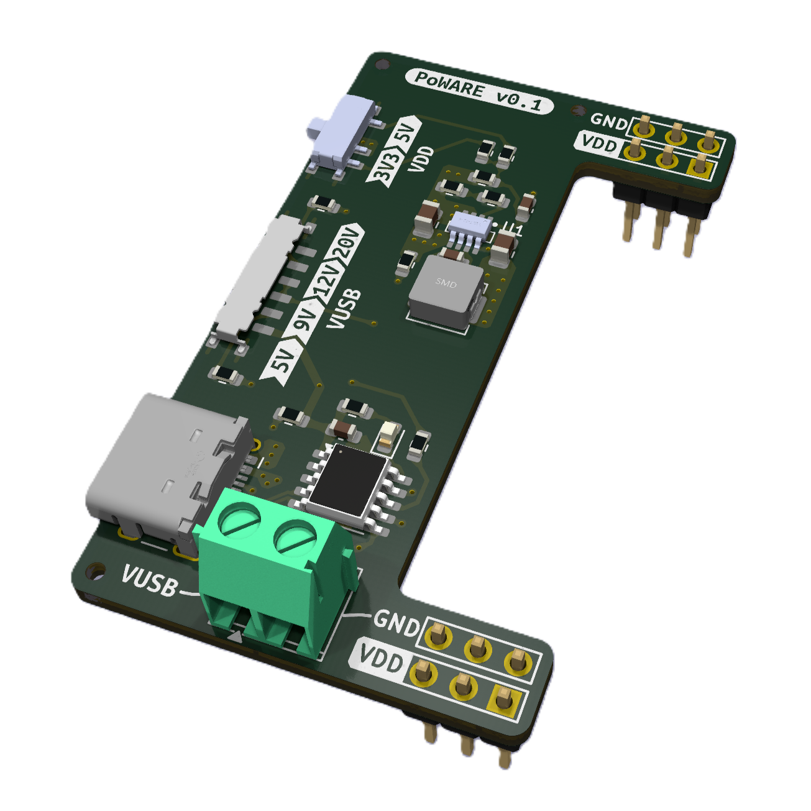

# PoWARE⚡

PoWARE is a handy breadboard power supply for the modern maker & engineer. 
 - 🔌 USB-C PD powered
 - ⚙️ Adjustable rail voltages: 3V3–5V
 - 🪛 Screw terminal for direct PD access: 5–20V

## How do I get one?
PoWARE will be available on Tindie when finished. If you're interested, please let me know by e-mail or contacting me on any of my socials.

## Licenses
PoWARE hardware is licensed under CERN-OHL-S-2.0. See LICENSE file.

## 📬 Get in Touch

- 📧 **Email**: [info@hardlyware.com](mailto:info@hardlyware.com)
- 📸 **Instagram**: [@hardlyware](https://www.instagram.com/hardlyware/)
- 🎥 **YouTube**: [HARDlyWARE](hhttps://www.youtube.com/@HARDlyWARE)